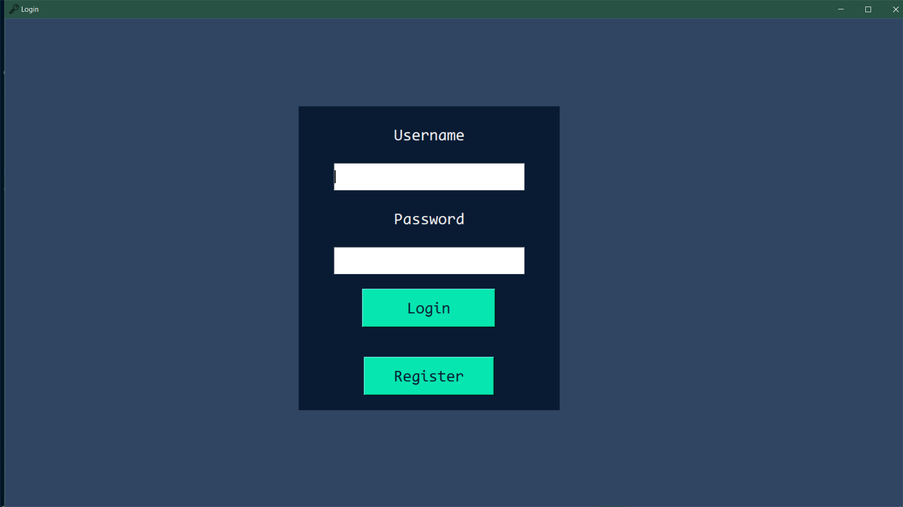
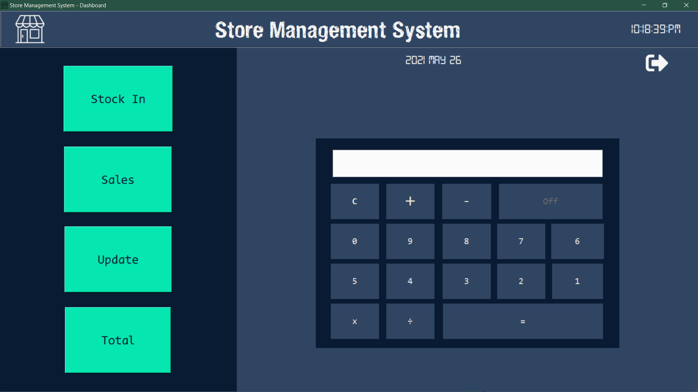
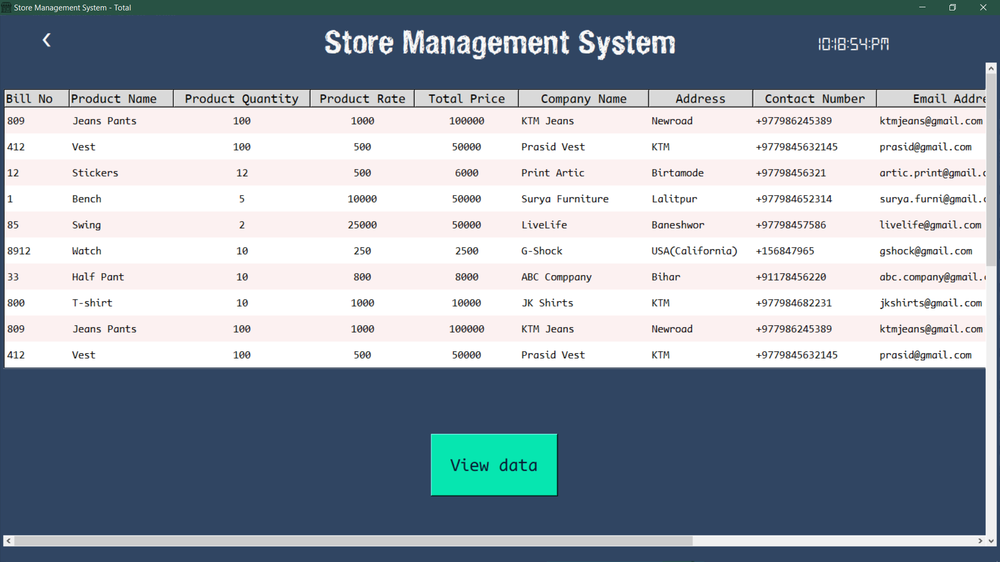

# STORE MANAGEMENT SYSTEM:department_store:

The Project **Management System Software** is developed using **Tkinter** , **Python** &amp; **SQLite3**. It's simple and easy to use. 

## Motivation😎
 It is developed as the final assignment of the first semester of BSC(Hons)Computing.
 
 ## Tools & Technology
 
 The tools used for this project are as shown below. If you don't have those tools you can follow below link to download.
 
 ### Tools🛠
 
 - [Pycharm](https://www.jetbrains.com/pycharm/download/#section=windows) as a editor for writing code for whole project.
 - [Git](https://git-scm.com/downloads) as version control.
 
 ### Technology👨‍💻
 
 - [Python](https://www.python.org/downloads/) as main programming language.
 - [Tkinter](https://docs.python.org/3/library/tkinter.html) python module for GUI interface.
 - [SQLite3](https://www.sqlite.org/download.html) as a database.
 
 ## Screenshot🖼
 Few **Screenshot** of project are show below :
<table>
  <tr>
    <td> </td>
   </tr>
   <tr>
    <td></td>
  </tr>
  <tr>
  <td></td>
  </tr>
 </table>
 
 ## Features feature
 
• It provides user authentication.

• It provides inventory in and out details.

• It keeps vendor details.

• It show data in tree view.

• It has calculator for calculations.

## Credits
**Websites, Blog Posts, Documentation**

### Coding 👨‍💻

[TkDoccs](https://tkdocs.com/) 

[TutorialsPoint](https://www.tutorialspoint.com/python/python_gui_programming.htm)

[GeeksforGeeks](https://www.geeksforgeeks.org/python-gui-tkinter/)

[Python Guides](https://pythonguides.com/category/python-tutorials/python-tkinter/)

### Icon & Color 
[Flaticon](https://www.flaticon.com/)

[Color Hunt](https://colorhunt.co/palettes/black)

 
